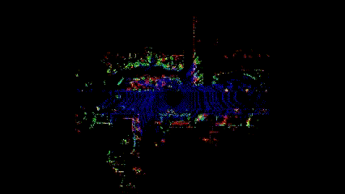
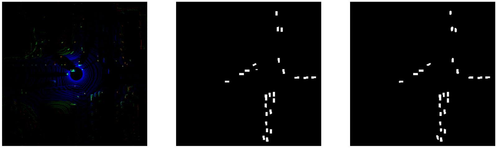
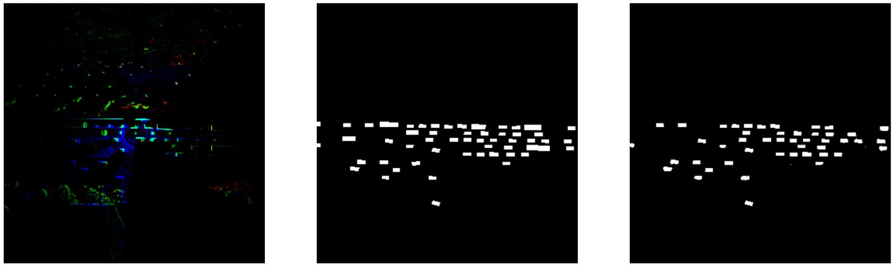

# Paired Image to Image translation Using U-NET generator, custom discriminator - PIX2PIX
Name: Santosh Vasa, Kishore Reddy Pagidi 
Date: December 15, 2022 
Class: CS 7180 - Advanced Perception

### Operating System Used:
- Windows Sub-system for Linux - Windows 11. For training and development.

### Link to the report
https://www.overleaf.com/project/6272ff260322860726c3fa3b

### How to run?
- Install requirements.txt   
` pip install -r requirements.txt`
- Add the project folder to the PYTHONPATH: 
`export PYTHONPATH=${PYTHONPATH}:/path_to_project_folder`
- Update parameters.yaml with the data location. 
- link to datasets :  
  - https://www.kaggle.com/competitions/3d-object-detection-for-autonomous-vehicles/data
- Run python file train.py  
`python3 train.py`

### RESULTS:
Areas where the network works well:
- Vehicles/classes near the ego vehicle
- Vehicles that are spaced apart.
- Non-overlapping line of sight vehicles.

Areas where the network does not work well:
- Objects occluded by other objects.
- Non square/rectangular segmentations. 
- Post processing errors.
- Objects detected farther from the ego's position.

### Example Inputs: BEV view afterlidar data projection 

 
  

### Outputs: In the order of (input, target and prediction)

